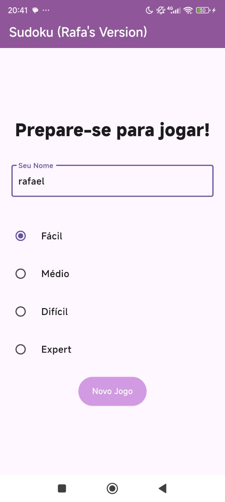
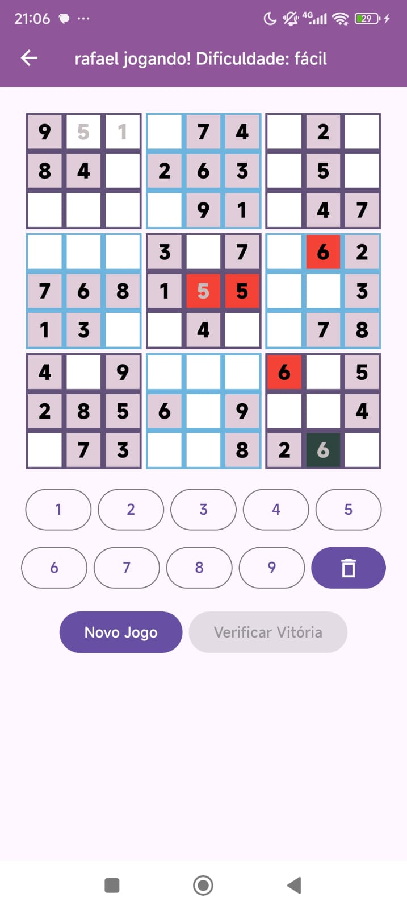
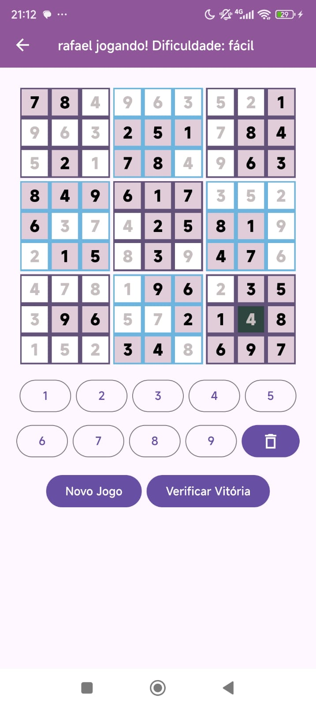
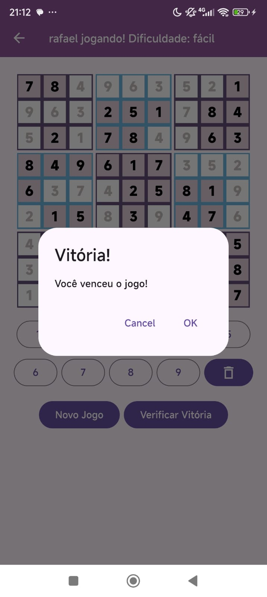

# sudoku

Projeto de criação de um app de Sudoku, em Flutter, para a disciplina de Laboratório Programação de Dispositivos Móveis (2024.2). Utiliza a biblioteca sudoku_dart para gerar os puzzles. Pode ser jogado em modo fácil, médio, difícil ou expert!

Imagens do jogo rodando em um aparelho Android:

